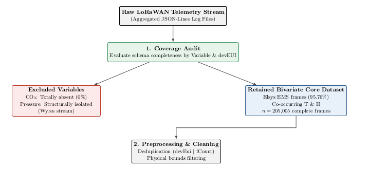
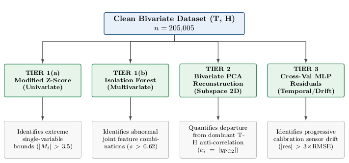
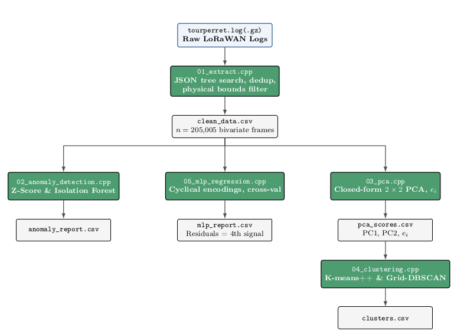
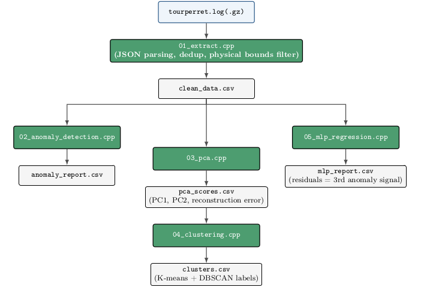

# Data Quality Audit and Analysis of a Long-Term LoRaWAN Network: Anomaly Detection, PCA, Clustering and Machine Learning

## Context and Operational Challenges in Long-Term IoT Monitoring

Long-term environmental monitoring via Low-Power Wide-Area Networks
(LPWAN)---specifically using the LoRaWAN protocol---presents unique data
engineering and data quality challenges. In real-world deployments such
as the Perret Tower (*Tour Perret*) dataset [Donsez et al., raw
telemetry streams suffer from network packet loss, heterogeneous payload
formats, multi-gateway frame duplication, and hardware configuration
shifts over time.

A common pitfall in multivariate anomaly detection and predictive
modeling is the *a priori* assumption of variable co-occurrence.
Researchers and practitioners often design processing pipelines
expecting all target variables---such as Temperature ($T$), Relative
Humidity ($H$), Atmospheric Pressure ($P$), and Carbon Dioxide
concentration ($\mathrm{CO_2}$)---to be present synchronously in every
transmitted frame. However, in multi-sensor LPWAN deployments, distinct
physical sensors often operate on different transmission schedules,
report varying payload schemas across firmware revisions, or belong to
completely separate device applications aggregated under a single
network server instance.

 

<figcaption>Figure 1: LoRaWAN telemetry ingestion and cleaning pipeline: the
coverage audit (Step 1) is executed before any downstream analysis,
separating structurally unusable variables (CO\(_2\), pressure) from the retained bivariate
(T,H) core dataset.</figcaption>
</figure>

## Theoretical Framework & Methodology 

### The Need for Multi-Tiered Anomaly Detection in IoT Streams 

Anomalies in environmental time-series data do not manifest as a single
homogeneous class. In edge-computing and IoT sensor contexts, anomalies
span a spectrum of behaviors:

- **Extreme Univariate Outliers:** Sensor spikes, electrical bursts, or
  out-of-spec hardware failures.

- **Multivariate Structural Anomalies:** Observations where each
  individual feature remains within normal seasonal bounds, but their
  *joint combination* violates fundamental physical laws or dominant
  environmental correlations.

- **Density-Based Clustered Anomalies / Noise:** Isolated noise points
  residing in low-density regions of the multivariate feature space.

- **Systemic Temporal Drifts:** Gradual, continuous calibration loss
  (e.g., aging capacitive humidity elements) that evades point-based
  detection because individual readings shift slowly over weeks or
  months.

  

 

<figcaption>Figure 2: Four-tier complementary detection framework: each tier
targets a distinct, orthogonal anomaly signature within the clean
bivariate (T,H) dataset.</figcaption>
</figure>

### Methodological Orthogonality Summary 

The theoretical necessity for this multi-tiered architecture is
summarized in the matrix below:

| Detection Tier | Underlying Principle | Primary Target Anomaly Type | Invariant / Insensitive To |
| --- | --- | --- | --- |
| **Modified Z-Score** | Marginal distance from median in units of MAD | Extreme single-variable spikes ($T$ or $H$) | Multivariate correlation violations within normal marginal bounds |
| **Isolation Forest** | Random axis-aligned space partitioning path length | Unusual joint combinations of $(T, H)$ | Slow, continuous calibration drifts over extended time horizons |
| **PCA Reconstruction Error** | Geometric distance to the primary variance subspace | Departures from global thermo-hygrometric correlation ($e_i = \lvert y_{\mathrm{PC2}} \rvert$) | Anomalies aligned perfectly along the primary axis of variance ($\mathrm{PC1}$) |
| **DBSCAN Noise Label** | Local density thresholding ($N_\varepsilon(p) < \mathrm{minPts}$) | Sparse spatial outliers and isolated noise points | Uniform dense clusters resulting from sensor resolution quantization |
| **MLP Cross-Validation** | Deviation from learned physical/temporal dependency | Slow sensor drift and temporal micro-climate anomalies | Sudden isolated point anomalies uncoupled from diurnal/seasonal trends |

## Data Processing & Analytical Pipeline 

### Data Acquisition, Coverage Audit & Cleaning 

The primary data acquisition and preprocessing layer is implemented in
`01_extract.cpp`. The raw corpus comprises $421,937$ JSON-Lines frames
transmitted by five distinct LoRaWAN nodes deployed at the Perret Tower
(*Tour Perret*) in Grenoble, France, between June 2021 and June 2023,
decoded by a ChirpStack network server [Donsez et al.] (DOI
10.18709/perscido.2023.06.ds395).

 

<figcaption>Figure 3: Data processing and analytical pipeline: from raw LoRaWAN
logs to the four output reports (anomaly, MLP, PCA/cluster) that feed
the Results section.</figcaption>
</figure>

<figcaption>Figure 4: The processing sequence mirrors the pipeline diagram.</figcaption>
</figure>
